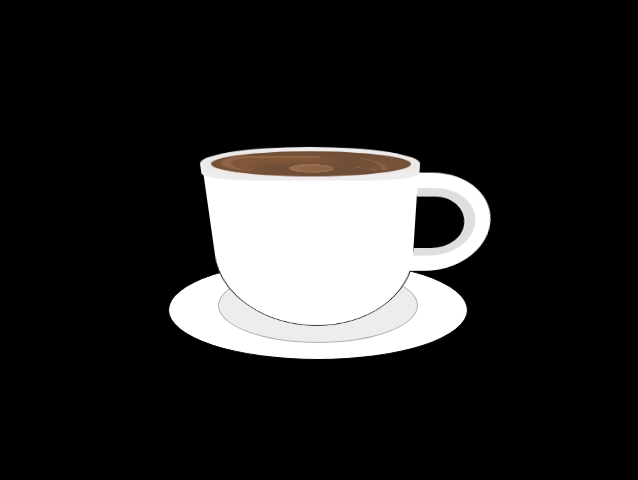

# Café com CSS

> Uma imagem criada com CSS puro para fins de prática e puro divertimento.

## 💻 Técnologias

- HTML
- CSS

## 🤝 Colaboradores

Agradecemos às seguintes pessoas que contribuíram para este projeto:

<table>
  <tr>
    <td align="center">
      <a href="https://github.com/EuFontoura" title="Acesse o Github">
         
        
          <b>Gabriel Fontoura</b>
        
      </a>
    </td>
  </tr>
</table>

## 📝 Licença

Sinta-se a vontade pra fazer o que quiser.